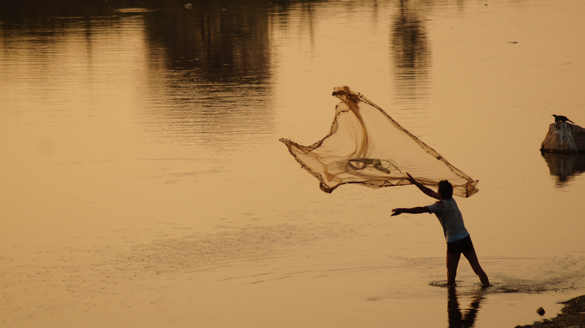

<!-- Global site tag (gtag.js) - Google Analytics -->

 

## *Fall 2021*

 

 
 

 
## Syllabus
* Download the Fall 2021 **[syllabus](FQ21/ANS_198_Syllabus_FQ_2021.pdf)**.
* View the **[resources collected by students in the course](Fall2020_ProfDev_ResDoc.html)**
* Familiarize yourself with:
  + [Territorial Acknowledgment](TerritorialAcknowledgement.html)
  + [Student Resources & Services](StudentResources_Services.html)
  + [Code of Academic Conduct](CodeOfConduct_Academic.html)
  + [Code of Conduct for Class Interactions](CodeOfConduct_Behavior.html)

## Location 
Storer Hall, Rm 1350

## Time
* COURSE: **TBD**
* OFFICE HOURS: **TBD**

## Credits 
2 units

## Instructor 
**[Meghan Zulian](Meghan.html)**

## Course Description
A professional
development seminar for sophomore, junior, and first-year transfer students interested in a career in the marine science that will teach students (1) how science works, (2) skills that will make them a successful student, (3) how to find career experiences during their time as undergraduates that will prepare them for careers after completing their Bachelor’s degree! This course covers topics spanning how to find and read scientific papers; what academic science/research entails; building a resume and/or CV; writing grant and fellowship applications; applying for jobs, internships, and graduate school; science communication; and science ethics. By the end of this seminar, undergraduate students should have a better understanding of how to (1) navigate their undergraduate experience as well as (2) explore career options after completing their degrees.

## Key Learning Outcomes
* Find and evaluate research papers
* Understand the cogs that underlie the scientific process
* Create a CV/resume that can be periodically modified
* Be able to submit a grant/fellowship application
* Be able to find internships, jobs, and research experiences
* Write an email to a prospective faculty advisor or employer
* Communicate science to non-technical audiences
* Navigate science with best ethical practices in mind
* **Leave with a compendium of resources to support the above outcomes!**

## Grading

* The class is graded as P/NP. Grades will be determined based on class participation and short, weekly written assignments
  +	To participate, you need to attend class and engage in the breakout sessions. Because we only meet once a week and **will be doing the bulk of our work in class**, missing several classes will put a passing grade in jeopardy.  
  +	Assignments will consist of a brief questionnaire after each class that will sometimes require doing a task related to that class’ topic (e.g., reading, exercise, research). These should be submitted  **by 12:00pm the day of class**.

* Because a key goal of this course is to share and collect resources, the bar for a passing grade is high: 
  +	You must attend 7/10 classes.
  +	All assignments must be turned in.

* *If you have obligations that will prevent you from attending 7/10 classes, please let me know so that we can discuss alternative arrangements for making sure you are getting the most out of this course!*

## Assignment Guidelines
Assignments will consist of a brief questionnaire after each class that will sometimes require doing a task related to that class’ topic (e.g., reading, exercise, research). These should be submitted  **by 12:00pm the day of class**.

Additionally, a quarter-long goal is to accumulate resources as a class that you can leave with and continue to reference as you continue throughout your careers. I will, of course, provide some of these, but **I expect you to also look for resources related to the previous week’s topic (this can be a book, a peer-reviewed article, a blog post, an Instagram post, a Facebook Group, a Twitter thread, an infographic, advice a professor gave you, something you learned from a lunch with a seminar speaker, etc.)**.

Ultimately, there is no single class you can take that will teach you everything you need to know, so learning how to search for and share the information you need is a good skill to hone. Through this exercise, I hope you will not only improve your ability to find information you need, but to also see your classmates as resources. Science is competitive, but the people who have helped me through it most are those working alongside me! The link for this document that we will flesh out over the course of the quarter is located on the course website and is available [here](Fall2021_ProfDev_ResDoc.html). You can also view the Fall 2020 class' resource document [here](Fall2020_ProfDev_ResDoc.html).

You can track the assignments you submitted on the **[Canvas Gradebook](https://canvas.ucdavis.edu/courses/481750/gradebook)**.

## JEDI in Marine Science
* You may notice that Justice, Diversity, Equity & Inclusion (JEDI) are not listed as an explicit topic in the course schedule. This is because JEDI pervades every aspect of our professional lives. Thus, we will be addressing these issues each week (in a segment I have cheekily named *"JEDI Mind Tricks”*). JEDI resources are also available [here](JEDImarsci.html).

*The instructor reserves the right to change details of the above course plans to ensure the best possible learning environment.*

## Lectures & Assignments  {.tabset .tabset-fade}

### Week 1
#### Introduction; Syllabus Overview; Class Activity
* Lecture Slides: [PDF](X.pdf)

### Week 2
#### Academic Science & Lab Culture
* Lecture Slides: [PDF](X.pdf)

### Week 3
#### Applying to Graduate School: Panel
* Lecture Slides: [PDF](X.pdf)

### Week 4
#### Applying for Grants & Fellowships
* Lecture Slides: [PDF](X.pdf)

### Week 5
#### Science Writing
* Lecture Slides: [PDF](X.pdf)

### Week 6
#### Science Communication
* Lecture Slides: [PDF](X.pdf)

### Week 7
#### Intro to Marine Science Careers
* Lecture Slides: [PDF](X.pdf)

### Week 8
#### Science Ethics & Advocacy & Activism
* Lecture Slides: [PDF](X.pdf)

### Week 9
#### Applying to Jobs/Internships
* Lecture Slides: [PDF](X.pdf)

### Week 10
#### Alumni Networking Panel
* Lecture Slides: [PDF](X.pdf)
