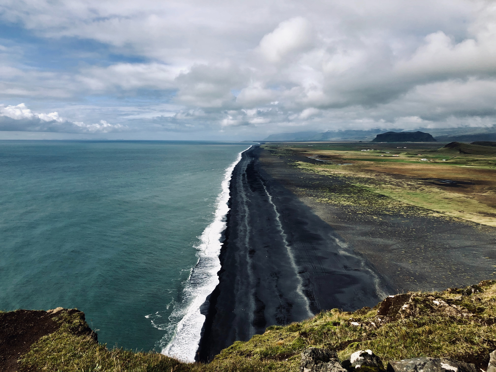

<!-- Global site tag (gtag.js) - Google Analytics -->

 

 
 

## General Advice
* On Not Suffering (Much) in Graduate School: [Part 1](https://luisalexis.com/2018/09/07/on-not-suffering-much-in-a-phd/) | [Part 2](https://luisalexis.com/2020/10/28/on-not-suffering-much-in-the-phd-part-2/)
* [MCSci Tips on Getting Into Grad School](https://geology.ucdavis.edu/students/careers/gradschool)
* [Academic Secret Menu, updated July 15, 2020](Res_Mentoring/ASecretMenu_15July2020.pdf)
* [Resources for Undegraduate Students](http://www.raulpacheco.org/resources/resources-for-undergraduate-students/) by Dr. Raul Pacheco-Vega
* [notes_for_students](https://gitlab.com/stanstrup-work/notes_for_students) by Jan Stanstrup
* [A Field Guide to Grad School](https://press.princeton.edu/books/paperback/9780691201092/a-field-guide-to-grad-school) by Jessica McCrory Calarco
* [Academia from the perspective of a first-generation student (Twitter thread)](https://twitter.com/AnnaMeierPS/status/1276544857977303043?s=20)
* [A UC Davis alumnus asked about grad school (Twitter Thread)](https://twitter.com/PollardKenzie/status/1284285187782656000?s=20) from July 2018
* [Evolution and Ecology Graduate School Preview](https://eegradpreview.weebly.com/)
* ["A guide for applying to graduate school in Biology"](Res_Mentoring/Application_Guide.pdf)
* [Cientifico Latino Graduate Student Mentorship Initiative (GSMI)](https://www.cientificolatino.com/gsmi)

## Developing Research Skills (Laboratory / Fieldwork)
* [Let's Experiment: A Guide for Scientists Working at the Bench (Self-Paced)](https://courses.ibiology.org/courses/course-v1:iBiology+LE+SP/about) via iBiology

## Contacting Potential Advisors
* [So, you want to go to grad school? Nail the inquiry email](https://contemplativemammoth.com/2013/04/08/so-you-want-to-go-to-grad-school-nail-the-inquiry-email/)

## Letters of Recommendation
* [How To Choose Letter Writers and Help Them Help You (Twitter Thread)](https://twitter.com/rwidome/status/1272923501708656644?s=20)

## Advice for the Application Process
* [Twitter Thread](https://twitter.com/MyOwnVelouria/status/1162097893462822913?s=20) from August 2019
* [Inclusive Graduate Education Network](http://www.igenetwork.org/)

## GRE Advice
* [350+ Bio/Biomedical programs that do not require the GRE](https://docs.google.com/spreadsheets/d/1MYcxZMhf97H5Uxr2Y7XndHn6eEC5oO8XWQi2PU5jLxQ/edit#gid=0)
* [Twitter Thread](https://twitter.com/OsmosisReads/status/1283183858847043586?s=20) from July 2020

## Funding Opportunities for Graduate School
* [Resources for POC in STEAM](https://docs.google.com/spreadsheets/d/1V_pvhqWliwqLhAVcXikxAEuJPD4mwwgl9LEgOnzN-zM/edit#gid=1417047090)
* [Departments that have a fully-funded Masters programs](https://docs.google.com/spreadsheets/d/1f34fVzPkKviz0732mU8YtkTnLVaNNUjK_SKCTSglD0o/edit#gid=0) that include Ecology, Evolution, or Organsimal Biology
* [AGU Bridge Program](https://www.agu.org/bridge-program)
* [National Science Foundation Graduate Research Fellowship Proposal (NSF GRFP)](http://www.nsfgrfp.org/)
  + [Advice](Res_Mentoring/GRFP-panel_100418-Brudvig-notes.pdf) from a GRFP writing workshop
* [Department of Defense National Defense Science and Engineering Graduate Fellowship Program (DoD NDSEG)](https://ndseg.sysplus.com/)
* [NOAA Dr. Nancy Foster Scholarship Program](https://fosterscholars.noaa.gov/)
* [NASA Graduate Student Research Fellowships](https://www.nasa.gov/stem/fellowships-scholarships/index.html)
* [Ford Family Foundation Scholarship](https://www.tfff.org/what-we-do/successful-citizens/postsecondary-success/scholarship-programs)
* [P. D. Soros Fellowship For New Americans](https://www.pdsoros.org/)
* [Ben Barres Fellowship](https://www.noglstp.org/programs-projects/ben-barres-fellowship/) for professional development of trans, intersex, and non-binary graduate students and post-doctoral fellows in STEM
* [National Geographic Early Career Grant](https://www.nationalgeographic.org/funding-opportunities/grants/what-we-fund/#EarlyCareer)
* [Women Divers Hall of Fame](http://www.wdhof.org/wdhof-scholarshipDesc.aspx)
* Other Funding Opportunities Are Listed [Here](excel/MarSci_GrantsFellowships.xlsx) (Updated July 2020)