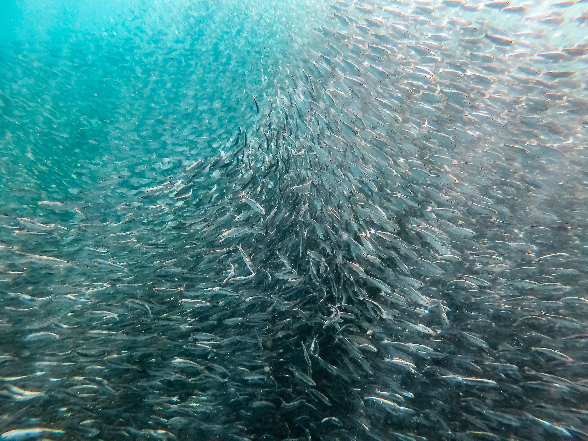

 

 

## Diversity, Equity and Inclusion at UC Davis
* [Office of Diversity, Equity and Inclusion](https://diversity.ucdavis.edu/diversity-resources)
* [Resources and Retention Centers](https://diversity.ucdavis.edu/diversity-resources)
* CMSI Social Justice in Science Learning Groups: contact <cmsi@ucdavis.edu> for more information

## JEDI in Marine Science
* From A Special Issue of [Oceanography]() entitled ["Graduate Education in the Ocean Sciences"](https://tos.org/oceanography/issue/volume-29-issue-01) (2016)
*All articles are open access*

  + [Strategies for Increasing Diversity in the Ocean Science Workforce Through Mentoring](https://doi.org/10.5670/oceanog.2016.11) by Johnson et al.
  + [The Ocean Science Social Diversity Challenge](https://doi.org/10.5670/oceanog.2016.12) by Gilligan & Ebanks
  + [MS PHD’S: By and for Minorities](https://doi.org/10.5670/oceanog.2016.13) by Ricciardi et al.

* [Minorities in Ocean Sciences: The LGBT Pride Weekend Edition](http://www.deepseanews.com/2011/06/minorities-in-ocean-sciences-the-lgbt-pride-weekend-edition/)
  + [Pride, Actually](http://www.deepseanews.com/2017/06/pride-actually/)

## Imposter Syndrome
* [Imposter syndrome isn’t the problem—toxic workplaces are](https://qz.com/work/1286549/imposter-syndrome-lets-toxic-work-culture-off-the-hook/) by Christine Liu

## Anti-Racism Resources
* [Scaffolded Anti-Racist Resources](https://docs.google.com/document/u/1/d/1PrAq4iBNb4nVIcTsLcNlW8zjaQXBLkWayL8EaPlh0bc/mobilebasic)
* [Anti-Racism Resources for White People/Parents](https://docs.google.com/document/d/1BRlF2_zhNe86SGgHa6-VlBO-QgirITwCTugSfKie5Fs/preview?pru=AAABcnZds8Y*BosNWbot9-ulTo9FajbiNA&fbclid=IwAR3Qp4sZO-mBv-0z2_ftOlbU8AwjFG8AsJFDbYv4MWepC313v1--31lTatw)
* [Developing an Anti-Racism Plan](https://www.shutdownstem.com/your-plan)
* [Is Your University Racist?](https://www.insidehighered.com/advice/2018/05/25/questions-institutions-should-ask-themselves-determine-if-they-are-operating#.XuCluRQiVfx.twitter)
* [You can't defeat racism with 'reading lists'](https://www.theguardian.com/commentisfree/2020/jun/12/anti-racist-reading-lists-educating-ourselves-in-the-streets)
* Doing The Work by Ambika Kamath
  + [Part One](https://ambikamath.com/2020/02/23/doing-the-work/)
  + [Part Two](https://ambikamath.com/2020/07/05/doing-the-work-part-two/)
* [Why I’ve struggled with the pressure to assimilate when teaching](https://www.sciencemag.org/careers/2020/06/why-i-ve-struggled-pressure-assimilate-when-teaching)

## Addressing Settler Colonialism
* [Decolonization is for Everyone (TED Talk)](https://www.youtube.com/watch?v=QP9x1NnCWNY&feature=youtu.be)
* [Accomplices Not Allies: Abolishing the Ally Industrial Complex](http://www.indigenousaction.org/accomplices-not-allies-abolishing-the-ally-industrial-complex/)
* [This Land (Crooked Media Podcast)](https://crooked.com/podcast-series/this-land/)
* [Indian Country Today](https://indiancountrytoday.com/)
* [Native California Magazine](https://www.ecosia.org/search?q=Native+California+Magazine&addon=chrome&addonversion=3.3.0&method=topbar)
* [California Through Native Eyes: Reclaiming History by William J Bauer](https://www.goodreads.com/book/show/27781495-california-through-native-eyes)
* [An Indigenous Peoples' History of the United States by Roxanne Dunbar-Ortiz](https://www.goodreads.com/book/show/20588662-an-indigenous-peoples-history-of-the-united-states)

## LGBTQIA+ Resources
* [500 Queer Scientists](https://500queerscientists.com/)
* [Queer in STEM: Workplace Experiences Reported in a National Survey of LGBTQA Individuals in Science, Technology, Engineering, and Mathematics Careers](https://www.tandfonline.com/doi/abs/10.1080/00918369.2015.1078632?journalCode=wjhm20) by Yoder et al. 2015

## Accessibility/Disabilities in STEM
* [STEM Climate for Students with Disabilities](https://www.higheredtoday.org/2018/05/23/stem-climate-students-disabilities/)
* [It’s time to stop excluding people with disabilities from science](https://massivesci.com/articles/disability-science-career-stem-field/)
* [How immunocompromised people manage risk (Twitter Thread)](https://twitter.com/geotransversals/status/1277410466973671424?s=20)

## Mental Health in STEM
* [The Importance of Mental Health Awareness in STEM!](https://thefemalescientist.com/guide/megan-sharrock-1/1989/the-importance-of-mental-health-awareness-in-stem/)

## Women in Science
* [500 WOmen Scientists](https://500womenscientists.org/resources)
* [American Association For University Women (AAUW)](https://www.aauw.org/get-empowered/)
* [Association for Women in Science (AWIS)](https://www.awis.org/)
