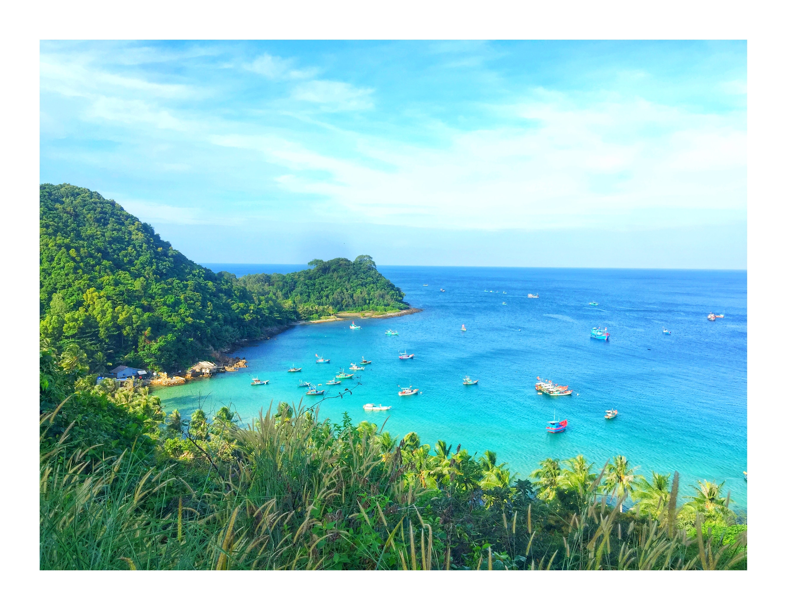

 

 
 
 

## If you have questions about ...
* Getting involved in the Marine Science Club, contact co-presidents Michael Brito (<mrbrito@ucdavis.edu>) & Maddie Frey (<mrfrey@ucdavis.edu>)
* Professional development opportunities and career planning, contact CMSI Lead Mentor Priya Shukla: <pshukla@ucdavis.edu>
* Your underdergrduate coursework and meeting degree requirements, contact Mandy Rousseau, the Undergraduate Advisor: <mlrousseau@ucdavis.edu>
* Your undergraduate career, in general, contact Anne Todgham, the Master Advisor for the MCS major: : <todgham@ucdavis.edu>
* Sharing your experiences as a marine science student at UC Davis on the [CMSI blog](https://marinescience.ucdavis.edu/blog), contact Jessica Ramos, the CMSI Marketing Specialist: <jmpramos@ucdavis.edu>
* [CMSI (Coastal and Marine Science Institute)](marinescience.ucdavis.edu) programs, contact Tawny Mata, the CMSI Executive Director: <tmmata@ucdavis.edu>