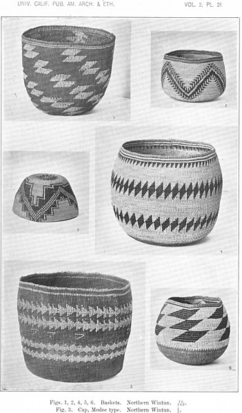

<!-- Global site tag (gtag.js) - Google Analytics -->

 

<figcaption>*Photo credit: A. L. Kroeber*</figcaption>
 
 

In the tradition of Native peoples across the Americas, [acknowledge](https://native-land.ca/territory-acknowledgement/) that the UC Davis campus exists on land that the Wintun/Patwin have thrived on since time immemorial. It is here that the Wintun/Patwin built their huts from earthen materials to wait out bad weather and carry out traditional dances in elaborate costumes. And, in places across Yolo and Solano counties, bedrock mortar sites still exist that show where the historical inhabitants ground acorns to remove their tannins. Although these communities were disrupted by the arrival of Spanish explorers who enslaved, abused and killed many Wintun/Patwin, their descendants are survived by the Yocha Dehe Wintun Nation.

As settlers, we must recognize how we benefit from colonialism and how it is has impacted the Native Peoples whose lands we now use. This is especially important in the marine sciences, where early exploration is at the root of much of our discipline, but often excludes the presence, culture and knowledge of Indigenous communities that coexisted and understood those resources and ecosystems before our intellectual forefathers did. Thus, it is incumbent upon us to dismantle components of settler-colonialism to ensure a more just and equitable future for not only the Wintun/Patwin, but all Indigenous Peoples.

This acknowledgement was made possible by [native-land.ca](native-land.ca) and [yochadehe.org](yochadehe.org). Consider using these resources to learn more about the Native Peoples' whose lands you currently occupy.