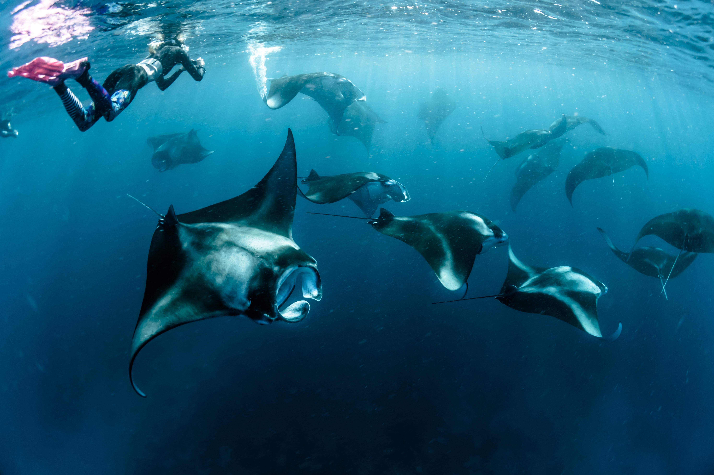

<!-- Global site tag (gtag.js) - Google Analytics -->

 

 

## Winter 2021

This will be a career exploration seminar for juniors, seniors and transfer students in the marine sciences. Each class will consist of a casual conversation with guest speakers, who span different marine science career paths at different stages, but there will be an emphasis on speakers with work experience after earning a B.A. / B.S. After each conversation, students will discuss and reflect upon what they gain from each conversation.

* Download the Winter 2021 [syllabus](WQ21/SYLLABUS_PLACEHOLDER.pdf).
* Familiarize yourself with:
  + [Territorial Acknowledgment](TerritorialAcknowledgement.html)
  + [Student Resources & Services](StudentResources_Services.html)
  + [Code of Academic Conduct](CodeOfConduct_Academic.html)
  + [Code of Conduct for Class Interactions](CodeOfConduct_Behavior.html)

## Location 
**SYNCHRONOUS** on Zoom, **link sent via email**

## Time
* COURSE: TBD
* OFFICE HOURS: TBD via Zoom, **link sent via email**

## Credits
2 units

## Instructor 
**[Priya Shukla](Priya.html)**

## Course Description
This will be a career exploration seminar for juniors, seniors and transfer students in the marine sciences. Each class will consist of a casual conversation with guest speakers, who span different marine science career paths at different stages, but there will be an emphasis on speakers with work experience after earning a B.A. / B.S. After each conversation, students will discuss and reflect upon what they gain from each conversation.

## Key Learning Outcomes
* Meet marine scientists in a wide variety of careers
* Increase your network of marine scientists
* Have examples of how to secure a “real job” after finishing your undergraduate degree
* Explore/Discover why certain positions may or may not be a good fit 
* **Have a better understanding of what it takes to get a marine science job**

## Grading

* The class is graded as P/NP. Grades will be determined based on class participation and guided reflections at the end of each class. 
  +	To participate, you need to attend class and engage in the conversations with guest speakers and each other. **We will be doing the bulk of our work in class**, so missing several classes will put a passing grade in jeopardy. 
  + Assignments will consist of a guided reflection during each class. These should be submitted **by the END of each class**.

* Because participation is a key component of this course, the bar for a passing grade is high: 
  + You must attend 7/10 classes.
  + You must submit 7/10 guided reflections.

If you have obligations that will prevent you from attending class or submitting assignments, please let me know so that we can discuss alternative arrangements for making sure you are getting the most out of this course!

* *If you have obligations that will prevent you from attending 7/10 classes, please let me know so that we can discuss alternative arrangements for making sure you are getting the most out of this course!*

## JEDI in Marine Science
* You may notice that Justice, Diversity, Equity & Inclusion (JEDI) are not listed as an explicit topic in the course schedule. This is because JEDI pervades every aspect of our professional lives. Thus, we will be addressing these issues each week (in a segment I have cheekily named *"JEDI Mind Tricks”*). JEDI resources are also available [here](JEDImarsci.html).

*The instructor reserves the right to change details of the above course plans to ensure the best possible learning environment.*

## Lectures & Assignments  {.tabset .tabset-fade}

### Week 1
#### Introduction; Syllabus Overview
  + Lecture [[recording coming soon]()]
  + Stories of Marine Scientists
    + **[Why I Pursued Marine Research](https://airplanesandavocados.com/why-i-pursued-marine-research-stories-from-scientists-around-the-world/)**: Stories from Scientists Around The World

 *More information coming soon!*
 
### Week 2
#### Guest Speaker: TBD
  + Lecture [recording coming soon]()

### Week 3
#### Guest Speaker: TBD
  + Lecture [recording coming soon]()

### Week 4
#### Guest Speaker: TBD
  + Lecture [recording coming soon]()

### Week 5
#### Guest Speaker: TBD
  + Lecture [recording coming soon]()

### Week 6
#### Guest Speaker: TBD
  + Lecture [recording coming soon]()

### Week 7
#### Guest Speaker: TBD
  + Lecture [recording coming soon]()

### Week 8
#### Guest Speaker: TBD
  + Lecture [recording coming soon]()

### Week 9
#### Guest Speaker: TBD
  + Lecture [recording coming soon]()

### Week 10
#### Guest Speaker: TBD
  + Lecture [recording coming soon]()

