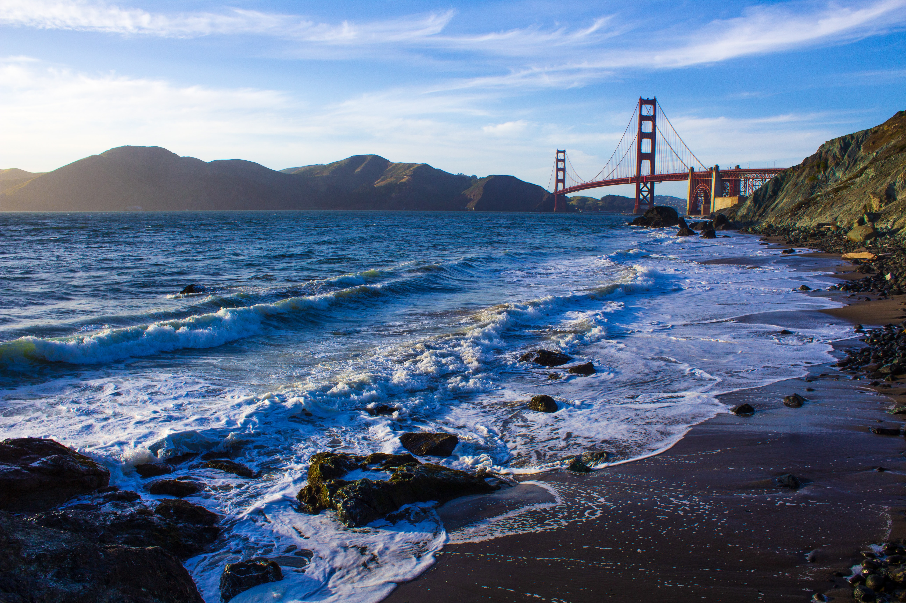

<!-- Global site tag (gtag.js) - Google Analytics -->

 

 
 

### Conferences for Marine Scientists
* [UC Davis Undergraduate Research, Scholarship and Creative Activities Conference](https://urc.ucdavis.edu/conference), 
* [WSN](http://www.wsn-online.org/), the Western Society of Naturalists
* [BEM or "Benthics"](https://www.bemsociety.org/), the Benthic Ecology Meeting
* [AGU](https://www.agu.org/fall-meeting), American Geophysical Union
* [SACNAS](https://www.sacnas.org/), Society for Advancement of Chicanos/Hispanics and Native Americans in Science
* [SICB](https://sicb.burkclients.com/), Society for Integrative and Comparative Biology
* [ESA](https://www.esa.org/), Ecologial Society of America
* [AAAS](https://meetings.aaas.org/), American Association for the Advancement of Science

