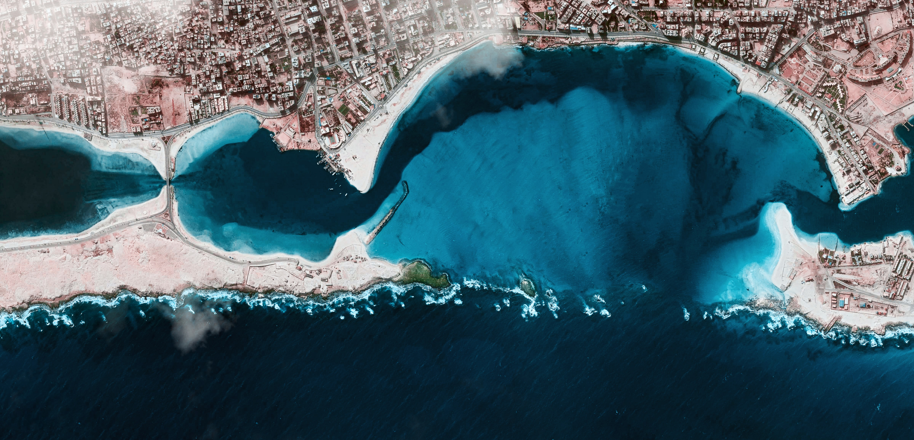

<!-- Global site tag (gtag.js) - Google Analytics -->

 
 
 

 

 

This resource is designed to help you navigate experiences beyond coursework, including research, funding, internships and jobs, as well as learning about the culture of science/academia.

 

If you have questions about declaring your emphasis, registering for courses, studying abroad, and joining clubs, you should check out the [MCSci Orientation](https://geology.ucdavis.edu/students/undergrad/mcsci/orientation) page. (You'll also find advice on undergraduate research and scholarship opportunities!)

 

This website has been designed with Marine and Coastal Science Majors at UC Davis in mind, but has resources for all marine science undergraduate students.

 

##### *Have questions? Contact the CMSI Lead Mentor, **[Meghan Zulian](Meghan.html)**.*

